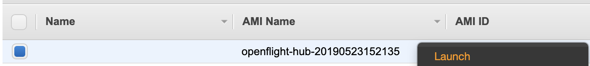

# Deploy an OpenFlight Hub

## Launch Hub

### AWS AMI

Available AMIs
```
RegionMap:
  eu-west-2:
    "AMI": "ami-0b42d3320b1ef09d0"
  eu-north-1:
    "AMI": "ami-0f480077ddfd0319c"
  ap-south-1:
    "AMI": "ami-0ad43b043436f5765"
  eu-west-3:
    "AMI": "ami-00800d4621737a206"
  eu-west-1:
    "AMI": "ami-019abb4b5d8b012e6"
  ap-northeast-2:
    "AMI": "ami-04a6d17368f3e9704"
  ap-northeast-1:
    "AMI": "ami-0790ab211aeaf2d3e"
  sa-east-1:
    "AMI": "ami-04c9ef9bef737f553"
  ca-central-1:
    "AMI": "ami-095d47bedcd788f2e"
  ap-southeast-1:
    "AMI": "ami-0286be737dd2e6da3"
  ap-southeast-2:
    "AMI": "ami-076b0fb4d329d52eb"
  eu-central-1:
    "AMI": "ami-0cf9e044dc0ccf459"
  us-east-1:
    "AMI": "ami-0ea099bb5ec6997c6"
  us-east-2:
    "AMI": "ami-092bcce6eb6286084"
  us-west-1:
    "AMI": "ami-0aeed8cbf94d7304c"
  us-west-2:
    "AMI": "ami-0abaf7574d2bd35a2"
```

- Launch OpenFlight AMI

    

- Select instance type

    

- Configure instance details (ensuring that a public IP is assigned)

    

- Configure storage space

    

- Name the instance

    

- Configure Security Group to include the following

    

- Launch instance

    

## Hub Configuration

- Login to hub

    ```
    [user@myhost ~]$ ssh centos@HUB-IP
    ```

- On first login, there will be some configuration questions

    ```
                                       __ _ _       _     _  ==>
       ==>                            / _| (_)     | |   | |  ==>
      ==>   ___   _ __    ___  _ __  | |_| |_  __ _| |__ | |_  ==>
     ==>   / _ \ | '_ \  / _ \| '_ \ |  _| | |/ _` | '_ \| __|  ==>
    ==>   | (_) || |_) ||  __/| | | || | | | | (_| | | | | |_    ==>
     ==>   \___/ | .__/  \___||_| |_||_| |_|_|\__, |_| |_|\__|  ==>
      ==>        |_|                           __/ |           ==>
       ==>                                    |___/           ==>
        ==>


    Deploying cloud resources requires at least one of either AWS or Azure credentials.

    For information on locating your cloud credentials, see:

        https://github.com/openflighthpc/flight-cloud#configuring-cloud-authentication

    At least one cloud provider must be configured

    Configure AWS Access Credentials? [y/n] y
    AWS Default Region: eu-west-1
    AWS Access Key ID: MyAWSaccessKeyID
    AWS Secret Access Key: MyAWSsecretAccessKey
    Configure Azure Access Credentials? [y/n] n


    Name for the cluster: mycluster
    Finishing cluster configuration...
    Generating Templates
    aws: |================================================================================================================================|
    azure: |==============================================================================================================================|

    OpenFlight Hub Configuration Complete!

    To deploy your cluster:

    1. Deploy the domain

        flight cloud aws deploy mycluster-domain domain

    2. Deploy the gateway

        flight cloud aws deploy gateway1 node/gateway1 -p "securitygroup,network1SubnetID=*mycluster-domain"

    3. Copy the SSH key to the gateway

        scp /root/.ssh/id_rsa root@GATEWAY-IP:/root/.ssh/

    4. Deploy the nodes (example given: node01)

        flight cloud aws deploy node01 node/node01 -p "securitygroup,network1SubnetID=*mycluster-domain"

    ```

- The default cluster has now been configured and is ready for deployment

## Deploy Cluster 

### To AWS

- Deploy the domain

    ```
    flight cloud aws deploy mycluster-domain domain
    ```

- Deploy the gateway

    ```
    flight cloud aws deploy gateway1 node/gateway1 -p "securitygroup,network1SubnetID=*mycluster-domain"
    ```

- Copy the SSH key to the gateway (GATEWAY-IP can be found via `flight cloud aws list machines`)

    ```
    scp /root/.ssh/id_rsa root@GATEWAY-IP:/root/.ssh/
    ```

- Deploy the nodes (example given: node01)

    ```
    flight cloud [aws/azure] deploy node01 node/node01 -p "securitygroup,network1SubnetID=*mycluster-domain"
    ```

### To Azure

- Deploy the domain

    ```
    flight cloud azure deploy mycluster-domain domain
    ```

- Deploy the gateway

    ```
    flight cloud azure deploy gateway1 node/gateway1 -p "securitygroup,network1SubnetID=*mycluster-domain"
    ```

- Copy the SSH key to the gateway (GATEWAY-IP can be found via `flight cloud azure list machines`)

    ```
    scp /root/.ssh/id_rsa root@GATEWAY-IP:/root/.ssh/
    ```

- Deploy the nodes (example given: node01)

    ```
    flight cloud azure deploy node01 node/node01 -p "securitygroup,network1SubnetID=*mycluster-domain"
    ```
